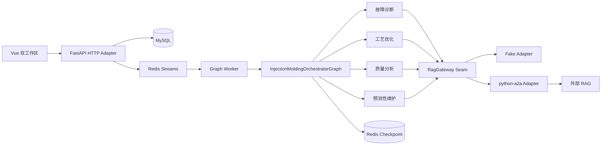

# MOLDWISE 当前架构

本文档描述当前代码，而 `injection-molding-a2a-system-design.md` 保留为早期 A2A 全互联方案的参考资料。

## 模块职责

- `domain` 定义稳定 Interface 和工业类型，不依赖 Web、数据库或 A2A。
- `application` 隐藏 LangGraph 路由、并行分支、证据聚合和安全门控。
- `infrastructure` 提供 MySQL、Redis、模拟遥测、OpenAI 兼容模型和 A2A Adapter。
- `web` 只处理鉴权、DTO、错误映射和 SSE，不包含 Agent 决策。
- `runtime` 组合 Adapter，并在 inline 与 Redis Worker 两种执行模式间切换。

## 关键约束

1. A2A 只允许出现在 `RagGateway` seam。
2. LLM 不接收数据库连接，也不能生成可执行 SQL。
3. 系统只读取模拟/外部遥测，不提供 PLC 写 Interface。
4. 任一已调度分支无有效证据或安全门控失败时采用 fail-closed；公开答案、findings 与 evidence 均不暴露原始诊断或操作建议。高风险证据只允许受限展示并转人工。
5. 设备访问通过显式用户授权 Module 统一校验，管理员不绕过设备授权；认证 Session 与 Refresh Token 轮换状态以 MySQL 为事实源。
6. 每个图调用按 `thread_id` 隔离 checkpoint，并按 `run_id` 关联事件和审计。
