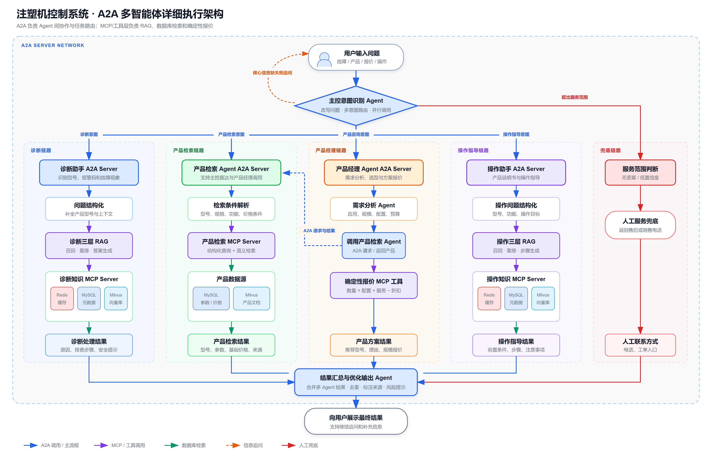

# 注塑机控制系统多智能体问答平台程序设计文档

| 项目 | 内容 |
|---|---|
| 文档版本 | V1.0 |
| 文档状态 | 设计稿 |
| 目标系统 | 注塑机控制系统多智能体问答平台 |
| 技术基础 | Conda `lang_env`、Python 3.12.11、A2A、MCP、LangChain、Redis、MySQL、Milvus、Streamlit/FastAPI |
| 参考工程 | `SmartVoyage` 多 Agent 示例工程 |

## 1. 文档目的

本文档用于指导注塑机控制系统多智能体问答平台的开发、联调、测试和部署。系统以现有 `SmartVoyage` 项目的意图识别、A2A Agent Network、MCP 工具调用和并行任务处理能力为基础，将旅游业务替换为注塑机控制系统公司的诊断、产品查询、产品选型报价和操作指导业务。

本文档重点说明：

- 系统总体架构和服务边界；
- 主控意图识别与多 Agent 路由规则；
- 四个业务 Agent 的处理流程；
- 三层 RAG 与 Redis、MySQL、Milvus 的数据分工；
- A2A 与 MCP 的接口协议；
- 产品检索、需求分析和确定性报价流程；
- 人工服务兜底、异常处理、安全和测试要求。

## 2. 项目范围

### 2.1 建设目标

系统面向客户、售后人员、销售人员和产品经理提供自然语言问答能力，实现：

1. 根据维修手册和售后维修文档回答设备故障与报警问题；
2. 根据明确的型号或产品条件查询产品参数、功能和基础价格；
3. 分析客户应用、规模、配置和预算，推荐产品并计算方案价格；
4. 根据产品说明书和操作手册返回可执行的操作步骤；
5. 当信息不足时继续追问，当答案可信度不足或超出服务范围时返回人工电话或工单入口。

### 2.2 不在本期范围内

- 不直接控制注塑机 PLC 或修改设备参数；
- 不替代正式售后工单系统和 CRM；
- 不允许大模型自由生成最终成交价格；
- 不处理未经授权的内部技术资料；
- 不对高风险维修操作给出无来源、无安全提示的执行指令。

## 3. 总体架构

详细架构图如下：



系统分为五个逻辑层：

| 层级 | 主要职责 |
|---|---|
| 交互层 | 接收用户问题、展示结果、管理会话和追问 |
| 编排层 | 意图识别、问题改写、多意图拆分、并行调用、结果汇总 |
| A2A Agent 层 | 诊断、产品检索、产品经理、操作助手四个独立 Agent Server |
| MCP/工具层 | RAG 检索、产品查询、报价计算和数据访问 |
| 数据层 | Redis 缓存与会话、MySQL 结构化数据、Milvus 向量数据 |

### 3.1 A2A 与 MCP 的边界

- A2A 用于智能体之间的任务通信、能力发现、任务状态管理和结果返回；
- MCP 用于 Agent 调用数据库、RAG、报价函数等确定性工具；
- 主控 Agent 通过 A2A 调用四个业务 Agent；
- 产品经理 Agent 通过 A2A 调用产品检索 Agent；
- 业务 Agent 通过 MCP 调用其下游工具和数据源。

### 3.2 运行拓扑与端口建议

| 类型 | 服务名称 | 建议端口 | 说明 |
|---|---|---:|---|
| Web | WebUI/API | 8501/8080 | Streamlit 原型或 FastAPI 正式接口 |
| A2A | DiagnosisAssistant | 5005 | 诊断助手 |
| A2A | ProductRetrievalAssistant | 5006 | 产品检索 Agent |
| A2A | ProductManagerAssistant | 5007 | 产品经理 Agent |
| A2A | OperationAssistant | 5008 | 操作助手 |
| MCP | DiagnosisKnowledgeTools | 8001 | 诊断三层 RAG |
| MCP | ProductSearchTools | 8002 | 产品结构化与语义检索 |
| MCP | PricingTools | 8003 | 确定性报价计算 |
| MCP | OperationKnowledgeTools | 8004 | 操作三层 RAG |

端口应通过环境变量配置，禁止在业务代码中硬编码生产地址。

### 3.3 Conda 运行环境

本项目以本机现有 Conda 环境 `lang_env` 作为开发和运行基线，不重新创建另一套相互独立的 Python 技术栈。

当前环境信息：

```text
环境名称：lang_env
环境路径：D:\Anaconda_envs\envs\lang_env
Python：3.12.11
```

开发、测试、启动和依赖检查均应在该环境中执行：

```powershell
conda activate lang_env
python --version
python -m pip check
python SmartVoyage/start_all.py --check
```

在 IDE 中应将解释器配置为：

```text
D:\Anaconda_envs\envs\lang_env\python.exe
```

生产环境不强制使用相同绝对路径，但 Python 大版本和核心依赖版本应与 `lang_env` 基线一致，并通过锁定文件保证可复现。

### 3.4 技术函数库基线

以下版本来自当前 `lang_env` 的实际安装结果。

#### 3.4.1 Agent、A2A 与 MCP

| 函数库 | 当前版本 | 在本项目中的用途 |
|---|---:|---|
| `python-a2a` | 0.5.4 | A2A Server、Agent Card、任务状态和 Agent Network |
| `mcp` | 1.18.0 | MCP Client/Server、Streamable HTTP 工具调用 |
| `mcp-server` | 0.1.4 | MCP 服务端辅助能力 |
| `langchain-mcp-adapters` | 0.1.11 | 将 MCP 工具接入 LangChain Agent |
| `langgraph` | 1.1.4 | 需要显式状态机时编排需求分析、检索和报价流程 |
| `langgraph-checkpoint` | 4.0.1 | 保存 LangGraph 工作流检查点 |
| `langgraph-prebuilt` | 1.0.8 | 复用预构建 Agent 节点 |

第一版继续以现有 `python-a2a` 调用方式实现四个 A2A Server。产品经理内部流程如果分支和状态恢复要求较高，可使用 LangGraph；简单的固定顺序流程不要求为了使用 LangGraph 而额外增加复杂度。

#### 3.4.2 大模型与 LangChain

| 函数库 | 当前版本 | 在本项目中的用途 |
|---|---:|---|
| `langchain` | 0.3.26 | Prompt、Chain 和工具编排 |
| `langchain-core` | 0.3.72 | 消息、Runnable、Prompt Template 等核心抽象 |
| `langchain-community` | 0.3.27 | 社区数据加载器和集成 |
| `langchain-openai` | 0.3.28 | OpenAI 兼容接口模型调用 |
| `langchain-deepseek` | 0.1.4 | DeepSeek 模型适配 |
| `langchain-text-splitters` | 0.3.9 | 维修手册和操作手册文本切片 |
| `openai` | 1.97.1 | OpenAI 兼容 API 客户端 |
| `anthropic` | 0.60.0 | 可选 Anthropic 模型客户端 |
| `dashscope` | 1.24.0 | 可选通义千问模型客户端 |
| `ollama` | 0.6.1 | 可选本地模型接口 |
| `langchain-ollama` | 1.0.1 | LangChain 本地模型适配 |
| `tiktoken` | 0.9.0 | Token 估算与上下文长度控制 |
| `langsmith` | 0.3.45 | 可选链路追踪和评测 |

`lang_env` 中同时存在 LangChain 0.3 系列与部分 1.x 生态包。开发时应执行集成测试，不应仅凭包已安装就认定版本组合完全兼容。新依赖升级应在独立分支验证后统一调整锁定版本。

#### 3.4.3 Web、接口与异步通信

| 函数库 | 当前版本 | 在本项目中的用途 |
|---|---:|---|
| `fastapi` | 0.116.1 | 正式 REST API、健康检查和管理接口 |
| `uvicorn` | 0.35.0 | FastAPI ASGI 服务运行器 |
| `streamlit` | 1.47.1 | 原型界面和内部演示工作台 |
| `pydantic` | 2.11.7 | A2A、MCP 和业务数据结构校验 |
| `pydantic-settings` | 2.10.1 | 环境变量和配置加载 |
| `httpx` | 0.28.1 | 异步 HTTP 客户端 |
| `aiohttp` | 3.12.15 | 异步网络请求 |
| `anyio` | 4.9.0 | 异步并发兼容层 |
| `sse-starlette` | 3.0.2 | 流式响应和服务器事件 |
| `websockets` | 14.2 | 可选 WebSocket 实时交互 |

#### 3.4.4 数据库与结构化数据处理

| 函数库 | 当前版本 | 在本项目中的用途 |
|---|---:|---|
| `mysql-connector-python` | 9.4.0 | MySQL 官方 Python 连接器 |
| `PyMySQL` | 1.1.1 | MySQL 纯 Python 连接器 |
| `mysqlclient` | 2.2.7 | MySQL C 扩展连接器 |
| `SQLAlchemy` | 2.0.42 | 连接池、事务和 Repository 实现 |
| `pandas` | 2.3.1 | 数据清洗、产品数据导入和离线评测 |
| `numpy` | 2.5.2 | 数值计算、向量和评测指标 |
| `orjson` | 3.11.1 | 高性能 JSON 序列化 |
| `pyarrow` | 21.0.0 | 批量数据交换与离线数据文件处理 |

MySQL 访问层建议统一采用 SQLAlchemy 2.x，并选择一个底层驱动。不要在不同 Repository 中混用三套 MySQL 驱动。

#### 3.4.5 文档、Embedding 与重排

| 函数库 | 当前版本 | 在本项目中的用途 |
|---|---:|---|
| `transformers` | 4.54.1 | 本地 Embedding、重排或分类模型 |
| `torch` | 2.7.1 | 本地模型推理运行时 |
| `tokenizers` | 0.21.4 | 文本分词 |
| `huggingface-hub` | 0.34.3 | 模型下载和缓存 |
| `safetensors` | 0.5.3 | 模型权重读取 |
| `lxml` | 6.0.0 | XML/HTML 文档解析 |
| `beautifulsoup4` | 4.13.4 | HTML 文档清洗 |
| `markdownify` | 1.2.3 | HTML 转 Markdown |
| `jieba` | 0.42.1 | 中文关键词切分和检索辅助 |
| `pillow` | 11.3.0 | 图片预处理 |
| `opencv-python-headless` | 5.0.0.93 | 扫描文档图像预处理 |

PDF、Word 和 OCR 的解析库应根据最终文档格式补充。入库组件对上层统一输出 `DocumentChunk`，避免业务 Agent 直接依赖具体文件解析库。

#### 3.4.6 配置、日志与可靠性

| 函数库 | 当前版本 | 在本项目中的用途 |
|---|---:|---|
| `python-dotenv` | 1.1.1 | 本地开发环境变量加载 |
| `PyYAML` | 6.0.2 | YAML 配置文件解析 |
| `colorlog` | 6.9.0 | 本地彩色日志 |
| `tenacity` | 9.1.2 | LLM、A2A、MCP 调用重试 |
| `schedule` | 1.2.2 | 轻量定时任务；正式生产建议使用外部调度器 |
| `cryptography` | 45.0.5 | 加密与安全相关能力 |

### 3.5 必须补充的依赖

当前 `lang_env` 中未检测到以下项目必需客户端：

| 待补充库 | 用途 | 要求 |
|---|---|---|
| `redis` | Redis 缓存、会话和任务状态 | 安装与目标 Redis Server 兼容的稳定版本 |
| `pymilvus` | Milvus Collection、向量写入和检索 | 安装与目标 Milvus Server 兼容的版本 |

在确定 Redis 和 Milvus 服务端版本后再锁定客户端版本：

```powershell
conda activate lang_env
python -m pip install redis pymilvus
python -m pip check
```

如果三层 RAG 使用独立重排模型，还应根据模型实现补充对应库。新增依赖后，应导出项目级锁定文件，而不是依赖整个个人环境的全部包：

```powershell
conda activate lang_env
python -m pip freeze > requirements-lock.txt
conda env export --from-history > environment.yml
```

`requirements-lock.txt` 用于锁定 Python 包的精确版本，`environment.yml` 用于记录 Python 和 Conda 层面的直接依赖。提交前应检查锁定文件中不包含本机路径、密钥和无关的个人工具包。

### 3.6 技术函数库使用原则

1. 优先复用 `lang_env` 已安装且经过现有工程验证的库；
2. A2A、MCP、模型调用、数据访问分别封装，不让业务 Agent 直接依赖底层客户端；
3. 所有输入输出统一使用 Pydantic 模型；
4. 数据库访问使用 Repository 模式；
5. 模型供应商通过统一 `LLMProvider` 接口切换；
6. RAG 通过统一 `Retriever`、`Reranker`、`AnswerGenerator` 接口组合；
7. 不在业务代码中执行 `pip install` 或动态安装依赖；
8. 每次调整核心库版本必须运行 A2A、MCP、RAG 和报价集成测试。

## 4. 功能设计

## 4.1 主控意图识别 Agent

### 4.1.1 职责

主控 Agent 是系统统一入口，负责：

1. 读取当前问题和最近若干轮会话；
2. 识别一个或多个业务意图；
3. 将上下文补充到改写后的子问题中；
4. 判断必要信息是否缺失；
5. 信息不足时生成追问；
6. 通过 A2A Server Network 路由任务；
7. 多意图任务使用 `asyncio.gather` 并行执行；
8. 合并各 Agent 结果并生成最终输出。

### 4.1.2 意图定义

| 意图代码 | 路由服务 | 典型问题 |
|---|---|---|
| `diagnosis` | DiagnosisAssistant | “E102 报警怎么处理？” |
| `product_lookup` | ProductRetrievalAssistant | “X300 控制系统有哪些接口？” |
| `product_consult` | ProductManagerAssistant | “20 台注塑机联网监控怎么配置？” |
| `quotation` | ProductManagerAssistant | “给 10 台设备计算一套方案价格” |
| `operation` | OperationAssistant | “怎么建立模具配方？” |
| `human_service` | 本地兜底 | “给我售后电话” |
| `out_of_scope` | 本地兜底 | 与公司产品和服务无关的问题 |

### 4.1.3 意图识别输出协议

```json
{
  "intents": ["diagnosis"],
  "user_queries": {
    "diagnosis": "X300 控制系统出现 E102 报警，如何排查？"
  },
  "entities": {
    "product_model": "X300",
    "alarm_code": "E102"
  },
  "follow_up_message": "",
  "request_id": "req-uuid"
}
```

约束：

- `intents` 只能使用预定义枚举；
- `user_queries` 必须包含每个有效意图对应的改写问题；
- 不得在意图识别阶段直接回答业务问题；
- 必要参数缺失时，`follow_up_message` 返回一个明确问题；
- 多意图场景允许返回多个意图，但互相依赖的任务应串行处理。

### 4.1.4 路由规则

```python
INTENT_AGENT_MAP = {
    "diagnosis": "DiagnosisAssistant",
    "product_lookup": "ProductRetrievalAssistant",
    "product_consult": "ProductManagerAssistant",
    "quotation": "ProductManagerAssistant",
    "operation": "OperationAssistant",
}
```

明确型号、规格或单项价格的问题优先路由至产品检索 Agent；需要分析需求、选型、组合配置或规模报价的问题路由至产品经理 Agent。

## 4.2 诊断助手

### 4.2.1 输入

- 产品型号；
- 控制器或设备版本；
- 报警代码；
- 故障现象；
- 已执行的排查操作；
- 会话上下文。

### 4.2.2 处理流程

1. 提取型号、报警码、故障现象等实体；
2. 判断诊断所需信息是否齐全；
3. 调用诊断三层 RAG MCP 服务；
4. 检索维修手册、售后维修案例和故障代码表；
5. 对证据进行重排和适用型号过滤；
6. 生成包含来源的诊断答案；
7. 低置信度、高风险或无证据时转人工服务。

### 4.2.3 输出结构

```json
{
  "status": "success",
  "agent": "DiagnosisAssistant",
  "summary": "E102 表示伺服驱动器过载。",
  "possible_causes": [
    {"cause": "机械负载过大", "confidence": 0.86},
    {"cause": "驱动器参数不匹配", "confidence": 0.72}
  ],
  "steps": [
    {"order": 1, "action": "停止设备并断开主电源", "risk": "high"},
    {"order": 2, "action": "检查机械传动是否卡滞", "risk": "medium"}
  ],
  "safety_notice": "涉及带电检查时须由授权人员操作。",
  "sources": [
    {"document_id": "manual-x300", "title": "X300 维修手册", "page": 32}
  ],
  "confidence": 0.84,
  "need_human_service": false
}
```

## 4.3 产品检索 Agent

### 4.3.1 定位

产品检索 Agent 是独立 A2A 服务，支持两种调用方式：

1. 主控 Agent 根据 `product_lookup` 意图直接调用；
2. 产品经理 Agent 完成需求分析后通过 A2A 调用。

两条路线必须复用同一个检索实现，禁止在产品经理 Agent 中复制产品查询代码。

### 4.3.2 检索方式

- MySQL 精确检索：型号、产品系列、接口数量、控制轴数、价格、状态；
- Milvus 语义检索：产品说明、应用领域、功能描述、选型文档；
- 元数据过滤：产品版本、销售区域、有效日期、是否停产；
- 结果融合：优先精确型号，其次结构化条件匹配，最后语义相似度匹配。

### 4.3.3 输入结构

```json
{
  "query": "适合 280 吨注塑机并支持联网监控的控制系统",
  "filters": {
    "product_model": null,
    "machine_tonnage": 280,
    "required_features": ["联网监控"],
    "sales_region": "CN"
  },
  "top_k": 5
}
```

### 4.3.4 输出结构

```json
{
  "status": "success",
  "matched_products": [
    {
      "product_id": "P10001",
      "model": "X300",
      "name": "X300 注塑机控制系统",
      "specifications": {
        "machine_tonnage_min": 200,
        "machine_tonnage_max": 350,
        "network": ["Ethernet", "OPC UA"]
      },
      "base_price": 18000.00,
      "currency": "CNY",
      "match_score": 0.91,
      "source": "product_catalog"
    }
  ],
  "missing_conditions": [],
  "need_human_service": false
}
```

## 4.4 产品经理 Agent

### 4.4.1 处理顺序

产品经理 Agent 必须按照以下顺序执行：

```text
需求分析 Agent
    → 产品检索 Agent（A2A 调用）
    → 确定性报价 MCP 工具
    → 产品方案生成
```

### 4.4.2 需求分析

需求分析 Agent 将自然语言转为结构化需求：

```json
{
  "application": "汽车连接器",
  "machine_count": 20,
  "machine_tonnage": 280,
  "control_type": "全电动",
  "required_features": ["高精度", "低能耗", "联网监控"],
  "optional_features": ["数据看板"],
  "budget": null,
  "deployment_region": "华东",
  "missing_fields": []
}
```

当以下核心字段缺失且会显著影响方案时，应先追问：

- 设备数量或项目规模；
- 注塑机吨位或设备型号；
- 必需功能；
- 部署方式；
- 报价币种或区域。

### 4.4.3 报价计算

报价必须由确定性工具完成，大模型只负责解释结果。

```text
设备小计 = Σ(产品单价 × 数量)
选配小计 = Σ(选配单价 × 数量)
服务小计 = 安装调试费 + 培训费 + 软件服务费
折扣金额 = (设备小计 + 选配小计) × 折扣率
税前总价 = 设备小计 + 选配小计 + 服务小计 - 折扣金额
含税总价 = 税前总价 × (1 + 税率)
```

报价工具输入：

```json
{
  "items": [
    {"product_id": "P10001", "quantity": 20},
    {"product_id": "OPT-MONITOR", "quantity": 20}
  ],
  "services": ["installation", "training"],
  "customer_level": "standard",
  "region": "CN-EAST",
  "tax_included": true
}
```

报价工具输出：

```json
{
  "currency": "CNY",
  "subtotal": 420000.00,
  "service_fee": 30000.00,
  "discount_rate": 0.05,
  "discount_amount": 21000.00,
  "tax_rate": 0.13,
  "total": 484770.00,
  "price_version": "2026-Q3",
  "valid_until": "2026-09-30",
  "requires_approval": false
}
```

### 4.4.4 人工审批条件

出现以下情况时不生成承诺性报价，只返回估算或转销售人员：

- 折扣超过当前用户权限；
- 产品价格不存在或已过有效期；
- 定制开发工作量无法自动确定；
- 跨区域税率、运费或安装费不明确；
- 客户要求正式合同报价；
- 总价超过配置的审批阈值。

## 4.5 操作助手

### 4.5.1 数据范围

- 产品说明书；
- 控制系统操作手册；
- 安装调试手册；
- 参数说明；
- 操作视频文字稿；
- 常见操作问答。

### 4.5.2 处理流程

1. 识别产品型号、软件版本、目标功能；
2. 缺少型号或版本时追问；
3. 调用操作三层 RAG MCP 服务；
4. 过滤不适用于当前型号的文档片段；
5. 按操作顺序生成答案；
6. 添加前置条件、注意事项和来源；
7. 对恢复出厂、清除数据、关闭保护等操作进行高风险标记。

### 4.5.3 输出结构

```json
{
  "status": "success",
  "agent": "OperationAssistant",
  "applicable_models": ["X300"],
  "prerequisites": ["使用工程师权限登录"],
  "steps": [
    {"order": 1, "action": "进入模具管理页面"},
    {"order": 2, "action": "选择新建模具配方"}
  ],
  "warnings": ["保存前确认当前模具编号"],
  "sources": [
    {"document_id": "op-x300", "title": "X300 操作手册", "page": 58}
  ],
  "confidence": 0.92,
  "need_human_service": false
}
```

## 4.6 结果汇总与优化输出

主控在所有任务完成后进行结果汇总：

1. 按原始意图顺序排列结果；
2. 合并重复信息；
3. 保留来源、置信度和风险提示；
4. 不修改确定性报价工具返回的数字；
5. 单个 Agent 失败时保留其他 Agent 的成功结果；
6. 需要人工服务时在末尾显示联系电话和工单入口；
7. 生成适合 Web 端展示的 Markdown 文本和结构化 JSON。

## 5. 三层 RAG 设计

本文将既有三层 RAG 统一定义为以下接口。若已有实现的内部层次不同，可保留原实现，但对 Agent 暴露的输入输出协议应保持一致。

### 5.1 第一层：混合召回

按以下顺序获取候选证据：

1. Redis 查询缓存和高频问答；
2. MySQL 根据型号、版本、报警码、文档类型等进行精确过滤；
3. Milvus 根据问题向量进行语义召回；
4. 合并候选集并去重。

建议参数：

- Redis 命中结果：最多 3 条；
- MySQL 精确候选：最多 20 条；
- Milvus 初始召回：`top_k=30`；
- 文档片段长度：400～800 中文字符；
- 相邻片段重叠：80～150 中文字符。

### 5.2 第二层：重排与证据过滤

- 使用重排模型或 LLM 评分；
- 型号、版本和文档状态作为硬过滤条件；
- 报警码完全匹配时提高权重；
- 同一文档相邻片段合并；
- 最终保留 5～8 条证据；
- 无有效证据时禁止大模型凭常识生成具体操作。

建议综合评分：

```text
final_score =
    0.45 × vector_score
  + 0.25 × rerank_score
  + 0.20 × metadata_match
  + 0.10 × document_priority
```

### 5.3 第三层：受约束答案生成

生成阶段要求：

- 只能依据检索到的证据回答；
- 明确区分“手册规定”和“历史维修经验”；
- 返回来源文档、页码或章节；
- 对不确定结论使用“可能原因”表达；
- 高风险操作必须附加安全警告；
- 证据不足时返回 `need_human_service=true`。

### 5.4 RAG 请求协议

```json
{
  "query": "X300 出现 E102 报警怎么处理？",
  "domain": "diagnosis",
  "filters": {
    "product_model": "X300",
    "software_version": null,
    "document_types": ["maintenance_manual", "service_case"],
    "language": "zh-CN"
  },
  "top_k": 8,
  "request_id": "req-uuid"
}
```

### 5.5 RAG 返回协议

```json
{
  "status": "success",
  "answer": "...",
  "evidence": [
    {
      "chunk_id": "chunk-uuid",
      "document_id": "manual-x300",
      "title": "X300 维修手册",
      "page": 32,
      "content": "...",
      "score": 0.91
    }
  ],
  "confidence": 0.86,
  "need_human_service": false
}
```

## 6. 数据设计

## 6.1 Redis

Redis 主要保存：

- 会话上下文；
- 意图识别和 RAG 查询缓存；
- 高频标准问答；
- 短期任务状态；
- 限流计数器。

建议键格式：

```text
session:{session_id}
intent:{query_hash}
rag:{domain}:{query_hash}:{filter_hash}
task:{task_id}
rate_limit:{user_id}:{minute}
```

会话和查询缓存必须配置 TTL，不得永久保存用户输入。

## 6.2 MySQL

### 6.2.1 文档表

```sql
CREATE TABLE knowledge_document (
    id BIGINT PRIMARY KEY AUTO_INCREMENT,
    document_id VARCHAR(64) NOT NULL UNIQUE,
    domain VARCHAR(32) NOT NULL,
    document_type VARCHAR(32) NOT NULL,
    title VARCHAR(255) NOT NULL,
    product_model VARCHAR(64),
    software_version VARCHAR(64),
    source_department VARCHAR(64),
    file_path VARCHAR(500),
    checksum VARCHAR(64) NOT NULL,
    status VARCHAR(20) NOT NULL DEFAULT 'active',
    version VARCHAR(32),
    effective_date DATE,
    created_at DATETIME NOT NULL,
    updated_at DATETIME NOT NULL,
    INDEX idx_document_filter(domain, product_model, document_type, status)
);
```

### 6.2.2 文档片段元数据表

```sql
CREATE TABLE knowledge_chunk (
    id BIGINT PRIMARY KEY AUTO_INCREMENT,
    chunk_id VARCHAR(64) NOT NULL UNIQUE,
    document_id VARCHAR(64) NOT NULL,
    page_number INT,
    section_title VARCHAR(255),
    chunk_order INT NOT NULL,
    milvus_id VARCHAR(64) NOT NULL,
    content_hash VARCHAR(64) NOT NULL,
    created_at DATETIME NOT NULL,
    INDEX idx_chunk_document(document_id, chunk_order)
);
```

### 6.2.3 产品表

```sql
CREATE TABLE product (
    id BIGINT PRIMARY KEY AUTO_INCREMENT,
    product_id VARCHAR(64) NOT NULL UNIQUE,
    model VARCHAR(64) NOT NULL,
    name VARCHAR(255) NOT NULL,
    product_series VARCHAR(64),
    description TEXT,
    specifications JSON NOT NULL,
    sales_region VARCHAR(32) NOT NULL DEFAULT 'CN',
    status VARCHAR(20) NOT NULL DEFAULT 'active',
    created_at DATETIME NOT NULL,
    updated_at DATETIME NOT NULL,
    INDEX idx_product_model(model, status),
    INDEX idx_product_series(product_series, status)
);
```

### 6.2.4 价格表

```sql
CREATE TABLE product_price (
    id BIGINT PRIMARY KEY AUTO_INCREMENT,
    product_id VARCHAR(64) NOT NULL,
    region VARCHAR(32) NOT NULL,
    currency VARCHAR(10) NOT NULL DEFAULT 'CNY',
    unit_price DECIMAL(14,2) NOT NULL,
    min_quantity INT NOT NULL DEFAULT 1,
    max_quantity INT,
    valid_from DATE NOT NULL,
    valid_to DATE NOT NULL,
    price_version VARCHAR(32) NOT NULL,
    approval_required BOOLEAN NOT NULL DEFAULT FALSE,
    INDEX idx_price_lookup(product_id, region, valid_from, valid_to)
);
```

### 6.2.5 折扣规则表

```sql
CREATE TABLE pricing_rule (
    id BIGINT PRIMARY KEY AUTO_INCREMENT,
    rule_code VARCHAR(64) NOT NULL UNIQUE,
    customer_level VARCHAR(32),
    region VARCHAR(32),
    min_amount DECIMAL(14,2),
    min_quantity INT,
    discount_rate DECIMAL(6,4) NOT NULL DEFAULT 0,
    approval_threshold DECIMAL(6,4),
    valid_from DATE NOT NULL,
    valid_to DATE NOT NULL,
    status VARCHAR(20) NOT NULL DEFAULT 'active'
);
```

### 6.2.6 人工服务配置表

```sql
CREATE TABLE service_contact (
    id BIGINT PRIMARY KEY AUTO_INCREMENT,
    service_type VARCHAR(32) NOT NULL,
    region VARCHAR(32),
    phone VARCHAR(32),
    work_order_url VARCHAR(500),
    working_hours VARCHAR(255),
    status VARCHAR(20) NOT NULL DEFAULT 'active'
);
```

## 6.3 Milvus

建议集合：

| 集合 | 内容 |
|---|---|
| `diagnosis_chunks` | 维修手册、故障代码表、售后维修案例 |
| `operation_chunks` | 产品说明书、操作手册、调试手册 |
| `product_chunks` | 产品介绍、选型文档、功能说明 |

建议字段：

```text
id                主键
chunk_id          文档片段标识
document_id       文档标识
domain            diagnosis / operation / product
document_type     文档类型
product_model     适用型号
software_version  适用版本
page_number       页码
content           原始文本
embedding         向量
status            active / disabled
```

## 6.4 文档入库流程

```text
上传文件
→ 病毒与格式检查
→ 文本/OCR 提取
→ 章节识别与切片
→ 元数据补充
→ 生成向量
→ 写入 Milvus
→ 写入 MySQL 元数据
→ 清理相关 Redis 缓存
→ 抽样验证
→ 发布为 active
```

维修资料和操作资料必须使用不同 `domain` 或不同 Milvus Collection，避免诊断答案错误引用操作说明。

## 7. A2A 接口设计

## 7.1 Agent Card

每个 Agent Server 必须提供独立 Agent Card。以诊断助手为例：

```python
agent_card = AgentCard(
    name="DiagnosisAssistant",
    description="提供注塑机控制系统故障诊断与排查指导",
    url="http://127.0.0.1:5005",
    version="1.0.0",
    capabilities={"streaming": True, "memory": True},
    skills=[
        AgentSkill(
            name="diagnose product issue",
            description="根据型号、报警码和故障现象检索维修资料并返回处理步骤",
            examples=["X300 出现 E102 报警怎么办"]
        )
    ]
)
```

## 7.2 A2A 任务请求

```json
{
  "task_id": "task-uuid",
  "request_id": "req-uuid",
  "session_id": "session-uuid",
  "intent": "diagnosis",
  "query": "X300 出现 E102 报警怎么办？",
  "entities": {
    "product_model": "X300",
    "alarm_code": "E102"
  },
  "conversation": [],
  "locale": "zh-CN"
}
```

## 7.3 A2A 任务状态

| 状态 | 含义 |
|---|---|
| `submitted` | 已提交 |
| `working` | 正在处理 |
| `input_required` | 缺少必要信息，需要追问 |
| `completed` | 成功完成 |
| `failed` | 执行失败 |
| `cancelled` | 已取消 |

业务结果放入 `artifacts`，追问信息放入状态消息中。主控必须正确处理 `input_required`，不能将其当作普通成功答案。

## 7.4 统一业务响应

```json
{
  "status": "success",
  "request_id": "req-uuid",
  "task_id": "task-uuid",
  "agent": "DiagnosisAssistant",
  "data": {},
  "message": "",
  "confidence": 0.86,
  "sources": [],
  "need_human_service": false,
  "elapsed_ms": 820
}
```

## 8. MCP 工具设计

建议提供以下工具：

| MCP Server | 工具名称 | 说明 |
|---|---|---|
| DiagnosisKnowledgeTools | `retrieve_diagnosis` | 查询诊断知识 |
| DiagnosisKnowledgeTools | `get_alarm_definition` | 精确查询报警码 |
| ProductSearchTools | `search_products` | 查询产品及参数 |
| ProductSearchTools | `get_product_price` | 查询有效基础价格 |
| PricingTools | `calculate_quote` | 计算规模报价 |
| PricingTools | `check_approval` | 判断是否需要审批 |
| OperationKnowledgeTools | `retrieve_operation` | 查询操作知识 |
| OperationKnowledgeTools | `get_manual_section` | 获取指定手册章节 |
| SharedTools | `get_service_contact` | 获取人工联系方式 |

MCP 工具必须：

- 使用 Pydantic 定义输入输出；
- 校验参数范围；
- 只允许参数化 SQL；
- 设置连接超时和查询超时；
- 返回结构化 JSON；
- 记录 `request_id`、工具名、耗时和状态；
- 不向大模型暴露数据库密码、内部路径和异常堆栈。

## 9. 软件模块与目录设计

建议在保留当前工程的情况下新增独立业务包：

```text
IndustrialAssistant/
├── app.py
├── main.py
├── config.py
├── start_all.py
├── prompts/
│   ├── intent_prompts.py
│   ├── diagnosis_prompts.py
│   ├── product_prompts.py
│   └── operation_prompts.py
├── orchestrator/
│   ├── intent_agent.py
│   ├── router.py
│   ├── result_aggregator.py
│   └── session_manager.py
├── a2a_server/
│   ├── diagnosis_server.py
│   ├── product_retrieval_server.py
│   ├── product_manager_server.py
│   └── operation_server.py
├── mcp_server/
│   ├── diagnosis_rag_server.py
│   ├── product_search_server.py
│   ├── pricing_server.py
│   └── operation_rag_server.py
├── rag/
│   ├── hybrid_retriever.py
│   ├── reranker.py
│   ├── answer_generator.py
│   ├── citation_builder.py
│   └── confidence.py
├── repositories/
│   ├── mysql_repository.py
│   ├── redis_repository.py
│   └── milvus_repository.py
├── schemas/
│   ├── common.py
│   ├── diagnosis.py
│   ├── product.py
│   ├── quotation.py
│   └── operation.py
├── ingestion/
│   ├── document_loader.py
│   ├── chunker.py
│   ├── embedding.py
│   └── indexer.py
└── tests/
    ├── unit/
    ├── integration/
    └── evaluation/
```

## 10. 核心时序

## 10.1 诊断问答

```text
用户
→ 主控意图识别 Agent
→ DiagnosisAssistant（A2A）
→ DiagnosisKnowledgeTools（MCP）
→ Redis/MySQL/Milvus
→ 三层 RAG
→ DiagnosisAssistant
→ 结果汇总 Agent
→ 用户
```

## 10.2 产品经理选型报价

```text
用户
→ 主控意图识别 Agent
→ ProductManagerAssistant（A2A）
→ 需求分析 Agent
→ ProductRetrievalAssistant（A2A）
→ ProductSearchTools（MCP）
→ MySQL/Milvus
→ ProductRetrievalAssistant
→ ProductManagerAssistant
→ PricingTools（MCP）
→ 产品方案生成
→ 结果汇总 Agent
→ 用户
```

## 10.3 多意图问答

用户问题：“推荐适合 280 吨设备的控制系统，并告诉我怎么建立模具配方。”

1. 主控识别 `product_consult` 和 `operation`；
2. 产品咨询与操作指导可以并行执行；
3. 如果操作答案依赖最终推荐型号，则应先完成产品咨询，再将推荐型号传给操作助手；
4. 结果汇总 Agent 按“产品建议—报价—操作步骤”顺序输出。

依赖关系必须由主控判断，不能对所有多意图任务无条件并行。

## 11. 人工服务兜底设计

触发条件：

- 意图为 `human_service` 或 `out_of_scope`；
- RAG 无有效证据；
- 综合置信度低于配置阈值；
- 涉及高风险操作且文档信息不足；
- 正式报价、特殊折扣或定制方案需要审批；
- 下游服务连续失败；
- 用户明确要求人工服务。

默认阈值建议：

```text
confidence >= 0.75：正常回答
0.55 <= confidence < 0.75：回答并提示确认，提供人工入口
confidence < 0.55：不输出具体操作，直接转人工
```

人工联系方式从 MySQL 配置表读取，按业务类型、客户区域和当前时间选择，不写死在提示词中。

## 12. 异常处理

| 异常 | 系统行为 |
|---|---|
| LLM 超时 | 重试一次；仍失败则返回友好提示 |
| A2A Agent 离线 | 保留其他 Agent 结果并显示对应服务暂不可用 |
| MCP 服务离线 | Agent 返回 `failed`，主控判断是否转人工 |
| Redis 不可用 | 跳过缓存，继续查询 MySQL/Milvus |
| MySQL 不可用 | 停止产品价格和精确查询，禁止生成报价 |
| Milvus 不可用 | 仅允许精确知识查询；证据不足则转人工 |
| JSON 解析失败 | 使用 Pydantic 校验并进行一次结构化重试 |
| 查询无数据 | 返回 `input_required` 或 `need_human_service` |
| 单 Agent 失败 | 不影响并行任务中的其他 Agent |

重试应采用指数退避，并设置全链路超时，避免重复调用造成请求堆积。

## 13. 安全设计

### 13.1 密钥与配置

- API Key、数据库密码和服务令牌必须来自环境变量或密钥管理服务；
- 禁止提交明文凭据到 Git；
- 现有示例工程中的明文密钥应立即吊销并替换；
- 开发、测试、生产环境使用独立配置。

### 13.2 数据安全

- 文档按部门、产品线和客户权限进行访问控制；
- 售后内部案例不得直接向外部客户展示敏感字段；
- 日志中脱敏手机号、客户名称、设备序列号和 API Key；
- 文档上传保留操作人、时间和版本审计记录；
- 禁用或过期文档必须从检索结果中立即排除。

### 13.3 SQL 安全

- 业务代码使用参数化 SQL；
- 不允许 LLM 输出的任意 SQL 直接执行；
- 查询工具使用只读数据库账号；
- 产品报价写操作使用独立权限；
- 对结果条数、执行时间和允许访问的表进行限制。

### 13.4 提示词注入防护

- 将用户输入、系统指令和检索文档明确分隔；
- 检索文档只作为数据，不视为系统指令；
- 忽略文档中要求泄露提示词、密钥或调用未授权工具的内容；
- 对工具名称和参数使用白名单；
- 对最终答案进行敏感信息扫描。

## 14. 日志与监控

每个请求应生成统一 `request_id`，贯穿 Web、主控、A2A 和 MCP。

建议记录：

- 用户会话标识和请求标识；
- 识别出的意图和实体；
- 路由的 Agent；
- A2A/MCP 调用耗时和状态；
- RAG 召回数量、重排分数和引用来源；
- 模型名称、Token 使用量和调用费用；
- 报价版本和审批状态；
- 人工兜底原因；
- 总响应时间和错误码。

关键监控指标：

```text
请求成功率
P50 / P95 / P99 响应时间
各意图占比
A2A/MCP 服务可用率
RAG 无结果率
人工兜底率
答案引用覆盖率
报价计算错误率
用户追问率
```

## 15. 性能设计

建议目标：

| 指标 | 目标值 |
|---|---:|
| 意图识别 P95 | ≤ 2 秒 |
| 普通知识问答 P95 | ≤ 8 秒 |
| 产品检索 P95 | ≤ 5 秒 |
| 选型报价 P95 | ≤ 10 秒 |
| 非 LLM 工具接口 P95 | ≤ 1 秒 |
| 服务月可用性 | ≥ 99.5% |

优化措施：

- Redis 缓存高频问题和检索结果；
- 多意图无依赖任务并行执行；
- MySQL 和 Milvus 使用连接池；
- 文档向量离线生成；
- 限制对话历史长度；
- 对引用文档进行摘要缓存；
- 设置 Agent、MCP 和全链路分级超时。

## 16. 测试设计

## 16.1 单元测试

- 意图识别 JSON 解析；
- 实体抽取和缺失字段判断；
- 报价公式和折扣边界；
- 产品过滤和排序；
- RAG 分数融合；
- 置信度和人工兜底判断；
- 输出格式化和来源引用。

## 16.2 集成测试

- 主控到四个 A2A Server 的调用；
- 产品经理到产品检索 Agent 的 A2A 调用；
- Agent 到 MCP Server 的调用；
- Redis、MySQL、Milvus 混合检索；
- `input_required` 多轮追问；
- 多意图并行与依赖执行；
- 下游超时、断连和重试。

## 16.3 RAG 评测

建立至少包含以下类型的标准问题集：

- 报警码精确查询；
- 故障现象模糊描述；
- 不同型号同名功能；
- 维修案例与手册结论冲突；
- 多步骤操作指导；
- 无答案问题；
- 高风险操作问题；
- 过期文档干扰问题。

评测指标：

- Recall@K；
- MRR/NDCG；
- 引用准确率；
- 答案忠实度；
- 型号适配正确率；
- 无答案拒答准确率；
- 人工兜底准确率。

## 16.4 验收场景

| 场景 | 预期结果 |
|---|---|
| 明确报警码和型号 | 返回原因、步骤、风险和来源 |
| 缺少产品型号 | 先追问型号，不直接给具体步骤 |
| 明确产品型号 | 直接调用产品检索 Agent |
| 模糊选型需求 | 产品经理先分析需求，再调用产品检索 |
| 20 台设备报价 | 使用报价工具计算并返回价格版本 |
| 正式合同报价 | 转销售人工审批 |
| 查询模具配方操作 | 返回有顺序的操作步骤和手册引用 |
| 无检索证据 | 不编造答案，转人工服务 |
| 两个无依赖意图 | 并行调用并合并结果 |
| 一个 Agent 离线 | 其他结果仍正常返回 |

## 17. 部署与启动设计

启动顺序：

```text
Redis / MySQL / Milvus
→ MCP Servers
→ A2A Agent Servers
→ 主控编排服务
→ WebUI/API
```

`start_all.py` 应维护两组服务列表：

```python
MCP_SERVICES = [
    ("mcp_diagnosis", "IndustrialAssistant.mcp_server.diagnosis_rag_server", 8001),
    ("mcp_product", "IndustrialAssistant.mcp_server.product_search_server", 8002),
    ("mcp_pricing", "IndustrialAssistant.mcp_server.pricing_server", 8003),
    ("mcp_operation", "IndustrialAssistant.mcp_server.operation_rag_server", 8004),
]

A2A_SERVICES = [
    ("a2a_diagnosis", "IndustrialAssistant.a2a_server.diagnosis_server", 5005),
    ("a2a_product", "IndustrialAssistant.a2a_server.product_retrieval_server", 5006),
    ("a2a_product_manager", "IndustrialAssistant.a2a_server.product_manager_server", 5007),
    ("a2a_operation", "IndustrialAssistant.a2a_server.operation_server", 5008),
]
```

生产环境建议使用容器或进程管理器独立运行各服务，并配置健康检查、自动重启和日志采集，不依赖开发环境的一键启动脚本维持服务。

## 18. 开发实施顺序

建议分四个阶段实施：

### 第一阶段：诊断助手 MVP

- 完成维修文档入库；
- 接入 Redis、MySQL、Milvus；
- 实现诊断三层 RAG；
- 实现 DiagnosisAssistant A2A Server；
- 支持来源引用和人工兜底。

### 第二阶段：操作助手

- 完成说明书和操作手册入库；
- 建立独立操作知识域；
- 实现 OperationAssistant；
- 增加高风险操作拦截。

### 第三阶段：产品检索与产品经理

- 建立产品、价格和折扣数据表；
- 实现 ProductRetrievalAssistant；
- 实现需求分析 Agent；
- 实现确定性报价 MCP 工具；
- 实现 ProductManagerAssistant 到产品检索 Agent 的 A2A 调用。

### 第四阶段：统一编排与生产化

- 完成主控多意图路由；
- 完成结果汇总与结构化输出；
- 增加监控、权限、审计和评测；
- 完成性能测试和生产部署。

## 19. 与现有 SmartVoyage 工程的迁移关系

| SmartVoyage 模块 | 新系统模块 |
|---|---|
| WeatherQueryAssistant | DiagnosisAssistant |
| TicketQueryAssistant | ProductRetrievalAssistant |
| TicketOrderAssistant | ProductManagerAssistant |
| Attraction 直接生成 | OperationAssistant |
| 天气 MCP | 诊断 RAG MCP |
| 票务查询 MCP | 产品检索 MCP |
| 票务预订 MCP | 报价 MCP |
| 旅游意图识别 | 工业产品业务意图识别 |
| `asyncio.gather` 并行处理 | 多业务意图并行处理 |
| Streamlit 前端 | 客户问答与内部工作台 |

迁移时应保留 A2A Server、Agent Card、Task 状态、MCP Streamable HTTP 和并行处理机制，替换旅游领域的提示词、数据表、Agent 名称和业务工具。

## 20. 待确认事项

开发前需要业务部门确认：

1. 三层 RAG 既有实现的准确分层和可复用接口；
2. 产品型号、价格、折扣和服务费的数据来源；
3. 报价是否含税、运费和安装费；
4. 正式报价的审批权限和阈值；
5. 售后电话按区域和工作时间的分配规则；
6. 高风险操作清单；
7. 维修案例中允许向外部客户展示的字段；
8. 产品说明书、维修手册的版本管理规则；
9. 生产环境部署方式和并发量目标；
10. 大模型、Embedding 模型和重排模型的最终选型。
